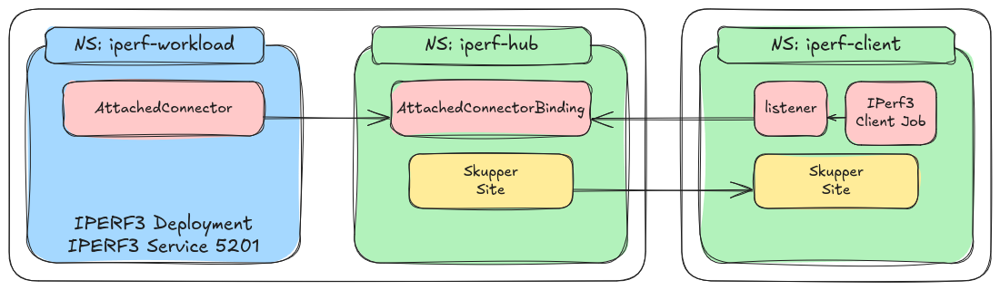

# 📌 **iPerf3 Attached Connector Test**  

## 📖 **Description**  
This test evaluates **network connectivity and performance** between different components using **iperf3** and **Attached Connectors**. The test environment is configured and executed using **Ansible**.  

## 

## 🏗 **Project Structure**  

```
.
├── ansible.cfg                 # Ansible configuration file
├── collections                 # Ansible collections directory
│   ├── ansible_collections
│   └── requirements.yml        # Collection dependencies
├── inventory                   # Inventory for Ansible hosts
│   ├── group_vars
│   │   └── all.yml             # Global variables for all hosts
│   ├── hosts.yml               # Inventory hosts definition
│   └── host_vars               # Variables for specific hosts
│       ├── iperf3-client.yml
│       ├── iperf3-hub.yml
│       └── iperf3-workload.yml
├── requirements.txt            # Python dependencies (if needed)
├── resources                   # Resource definitions
│   ├── iperf3-client
│   │   ├── iperf3-consumer.yaml
│   │   ├── listener.yml
│   │   └── site.yml
│   ├── iperf3-hub
│   │   ├── attached-connector-binding.yml
│   │   └── site.yml
│   └── iperf3-workload
│       └── attached-connector.yml
└── test.yml                    # Main playbook for the test
```

## ▶ **How to Run the Test**  

Execute the following command to run the **iperf3-attached** test using Ansible:  

```bash
ansible-playbook tests/e2e/iperf3-attached/test.yml -i tests/e2e/iperf3-attached/inventory -e kubeconfig=<YOUR KUBE CONFIG>
```

### **Parameters**:  
- `-i tests/e2e/iperf3-attached/inventory`: Specifies the inventory file.  
- `-e kubeconfig=<YOUR KUBE CONFIG>`: Passes the Kubernetes configuration file required for execution.  

## 🛠 **Requirements**  

Ensure the following dependencies are installed:  
- **Ansible**  
- **iperf3**  
- **A valid Kubernetes environment with Attached Connectors configured**  
